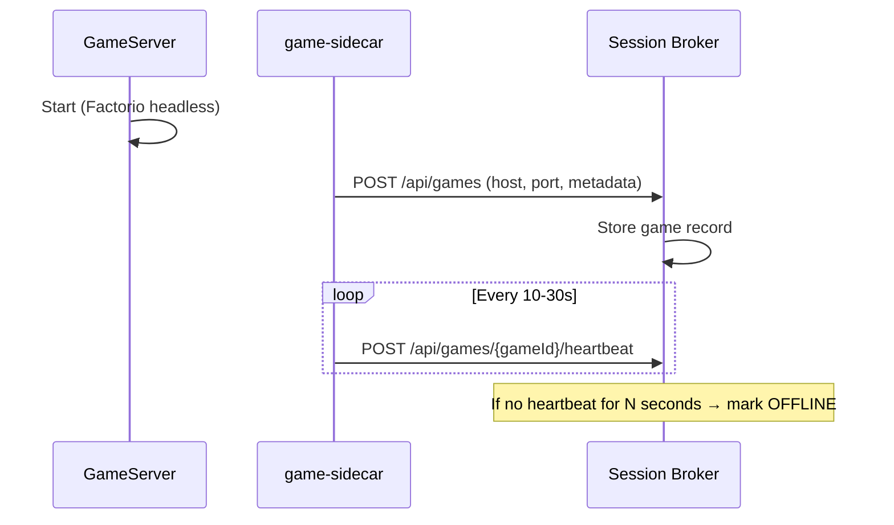
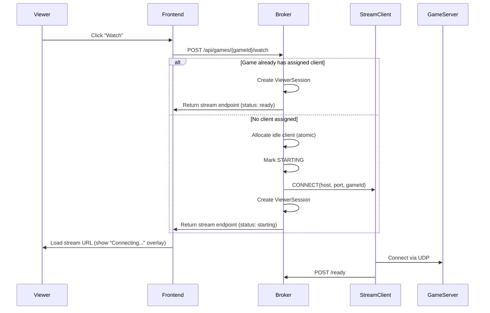

# ClaudeTorio Architecture Document

**AI-Powered Factorio Game State Streaming System (Prototype-first, scalable later)**

**Target:** Working prototype on Docker Compose suitable for seed fundraising + ~100 early users

**Non-goals:** Kubernetes, global-scale multi-region, "Twitch-grade" reliability

---

## 1. Executive Summary

ClaudeTorio is a **three-tier system** that **decouples simulation from rendering**:

| Tier | Cost | Scale | Purpose |
|------|------|-------|---------|
| **Tier 1** | Cheap | Many | Headless Factorio servers running AI games 24/7 |
| **Tier 2** | Expensive | Few | GPU-capable streaming clients (Selkies + Factorio GUI) that attach to any game on-demand |
| **Tier 3** | Free | Unlimited | Viewers connect via browser using WebRTC to whichever client is assigned |

This design avoids the classic 1:1 "one game instance per streaming renderer" scaling trap. Instead, you allocate render capacity **only when a game has viewers**, and reclaim it when idle.

---

## 2. Constraints, Assumptions, and Invariants

### 2.1 Prototype Constraints

- **Docker Compose only** (single host or a couple of VMs is fine)
- **Client pool:** 3–5 streaming clients (scale to ~20 on one GPU box later)
- **Game servers:** 5–20 games in prototype (scale up by adding CPU boxes)
- **Cold start acceptable:** 5–15 seconds to start streaming is okay UX

### 2.2 Key Factorio Constraints (must design around)

| Constraint | Details | Source |
|------------|---------|--------|
| **Server port + protocol** | Factorio servers use **UDP** and default to port **34197**; clients and servers must match **exact game version and mods** | [Factorio Wiki - Multiplayer][1] |
| **Headless auto-pause** | Headless servers pause when no players are connected unless configured otherwise (important because AI must run even with 0 viewers) | [Factorio Wiki - Multiplayer][1] |
| **Client connects via CLI** | Factorio supports `--mp-connect` for client auto-connect flows | [Factorio Wiki - Command Line][2] |

### 2.3 FLE Version Pinning

FLE's docs list **Factorio 1.1.110** as the supported version for optional rendering. To avoid version mismatch/desync headaches during fundraising prototype, **pin server + client to Factorio 1.1.110**. ([GitHub - FLE][3])

> **Note:** Factorio's current stable headless is newer (e.g., 2.0.73)—treat upgrading as a planned milestone, not a prototype dependency. ([Factorio Downloads][4])

### 2.4 Selkies Networking Constraints

| Constraint | Details |
|------------|---------|
| **Port range** | WebRTC often requires opening a large UDP/TCP port range on the host for direct peer connectivity; Selkies docs mention opening **49152–65535** for standalone deployments |
| **Host networking** | Running containers with `--network=host` is an "easy fix," but Selkies warns multiple desktop containers in host networking can be problematic |
| **TURN recommendation** | For multi-client pools, a **TURN server is the robust path** |
| **Configuration** | Selkies supports TURN configuration via env vars: `SELKIES_TURN_HOST`, `SELKIES_TURN_PORT`, `SELKIES_TURN_USERNAME`, `SELKIES_TURN_PASSWORD`, etc. |

Source: [Selkies Firewall Docs][5]

**Prototype design choice:** Use a self-hosted **coturn** TURN server and configure Selkies clients to use it by default.

---

## 3. Core Abstractions (the Mental Model)

### 3.1 GameServer

A long-running simulation:

- Always running (AI acts continuously)
- Identified by `gameId`
- Addressable (host/port) for Factorio multiplayer and for AI control (FLE/RCON)

### 3.2 StreamClient (Pool Slot)

A long-running container that can be "pointed at" a game:

- Runs Selkies WebRTC server continuously
- Runs **Factorio GUI only when assigned**
- Has a stable `clientId` and stable streaming endpoint (URL)

### 3.3 Assignment

A bijection at any instant:

- `gameId -> clientId` is **0 or 1** (at most one streaming client per game at a time)
- `clientId -> gameId` is **0 or 1** (a pool slot streams at most one game at a time)

### 3.4 ViewerSession

A short-lived "lease" that counts as a viewer:

- Has a TTL refreshed by heartbeat
- Determines when a client should stay active vs return to pool

---

## 4. High-Level Architecture

### 4.1 Control Plane vs Data Plane

**Control plane (Broker):**

- Tracks games, clients, assignments, viewer sessions
- Decides which client attaches to which game
- Generates/returns TURN credentials and stream URLs
- Handles health checks and recovery

**Data plane (Video):**

- Browser connects **directly** to Selkies for streaming (WebRTC)
- Broker is not in the media path (except optional auth proxying)

### 4.2 Component Diagram

```
+-------------------+            +------------------------+
|   Web Frontend    |<---------->|  Session Broker (API)  |
|  (Next.js/React)  |  REST/WS   |  Redis-backed state    |
+---------+---------+            +-----+------------------+
          |                              |
          | stream URL + TURN creds       | control commands
          v                              v
+-------------------+            +------------------------+
| Browser (Viewer)  |  WebRTC    | StreamClient Pool      |
|                   |<---------->| (Selkies + Factorio GUI|
+-------------------+            |  + control sidecar)    |
                                 +-----------+------------+
                                             |
                                             | UDP Factorio multiplayer
                                             v
                                 +------------------------+
                                 | GameServer Cluster     |
                                 | (Factorio headless)    |
                                 +------------------------+
                                             ^
                                             |
                            AI actions (FLE/RCON/HTTP)
                                             |
                                 +------------------------+
                                 | AI Agent / FLE MCP     |
                                 +------------------------+
```

---

## 5. Critical Flows

### 5.1 Game Registration Flow (server comes online)

**Goal:** Make a game discoverable even when not streaming.



### 5.2 Watch Flow (viewer requests to watch a game)

**Goal:** Attach a pool client on-demand with bounded wait and clear UX.



### 5.3 Leave Flow (viewer closes tab)

Browser "unload" is unreliable; design must survive abrupt disconnects.

**Implementation approach:** ViewerSession heartbeats

- Frontend sends heartbeat every 10–15s
- If heartbeat stops, broker TTL expires and viewer is removed

**When viewer count drops to 0:**

1. Client transitions `ACTIVE -> DRAINING`
2. After drain timeout (e.g., 30s), broker sends `DISCONNECT`
3. Client goes `IDLE`

---

## 6. The Session Broker

### 6.1 Responsibilities

| Responsibility | Description |
|----------------|-------------|
| **Game Registry** | CRUD + health status of Factorio servers |
| **Client Pool Manager** | Track each client's state and assignment |
| **Assignment Engine** | Decide allocation, avoid races, enforce invariants |
| **Viewer Session Tracking** | Accurate viewer counts via TTL/heartbeat |
| **Lifecycle + Recovery** | Stuck STARTING, crashed clients, reconnect loops |
| **TURN Coordination** | Return TURN settings to frontend (and/or to clients) |

### 6.2 Tech Choices (prototype-friendly)

- **FastAPI** (Python) for broker API
- **Redis** for fast ephemeral state + distributed locks
- **Postgres optional** for durable audit/history (nice-to-have for fundraising metrics)

> For a prototype: Redis-only is fine. Add Postgres when you want analytics and durability.

### 6.3 Data Model (Redis Schema)

#### Keys

| Key Pattern | Type | Fields/Purpose |
|-------------|------|----------------|
| `game:{gameId}` | hash | `name`, `host`, `port`, `status`, `metadata_json`, `lastHeartbeatTs` |
| `games:all` | set | All gameIds |
| `client:{clientId}` | hash | `status`, `assignedGameId`, `lastStatusTs`, `publicStreamHost`, `publicStreamPath`, `controlUrl` |
| `clients:all` | set | All clientIds |
| `clients:idle` | set | ClientIds currently IDLE (source of truth for allocation) |
| `assignment:game:{gameId}` | string | ClientId (if assigned) |
| `assignment:client:{clientId}` | string | GameId (if assigned) |
| `viewer:{viewerId}` | hash (TTL ~45s) | `gameId`, `clientId`, `lastSeenTs`, `userAgent`, `ipPrefix` |
| `viewers:client:{clientId}` | set | ViewerIds (needs periodic cleanup) |
| `viewers:game:{gameId}` | set | ViewerIds (optional) |

#### Locks

| Lock Key | TTL | Purpose |
|----------|-----|---------|
| `lock:game:{gameId}` | 5s | Prevent race conditions on game assignment |
| `lock:client:{clientId}` | 5s | Prevent race conditions on client state changes |

### 6.4 Broker State Machine (Client Pool)

```
                    ┌─────────────────────────────────────────┐
                    │                                         │
                    v                                         │
    ┌──────┐    ┌──────────┐    ┌────────┐    ┌──────────┐   │
    │ IDLE │───>│ STARTING │───>│ ACTIVE │───>│ DRAINING │───┘
    └──────┘    └──────────┘    └────────┘    └──────────┘
        ^            │               │
        │            v               v
        │       ┌─────────┐     ┌─────────┐
        └───────│  ERROR  │<────│  ERROR  │
                └─────────┘     └─────────┘
```

**State Definitions:**

| State | Description |
|-------|-------------|
| `IDLE` | No Factorio process running, not assigned |
| `STARTING` | Factorio launching and syncing |
| `ACTIVE` | Streaming and has >=1 viewers |
| `DRAINING` | 0 viewers, waiting for potential quick rejoin |
| `ERROR` | Client unhealthy; broker should restart/reset it |

---

## 7. Broker API Contract

### 7.1 Public API (frontend + game registration)

#### Games

**`POST /api/games`** - Register a new game

```json
// Request
{
  "name": "iron-base-472",
  "host": "factorio-server-472",
  "port": 34197,
  "metadata": {
    "aiAgent": "claude-sonnet",
    "mapName": "default",
    "startedBy": "fle-cluster"
  }
}

// Response
{ "id": "g_abc123", "status": "ONLINE" }
```

**`GET /api/games?cursor=...`** - List games

```json
// Response
{
  "games": [
    {
      "id": "g_abc123",
      "name": "iron-base-472",
      "status": "ONLINE",
      "hasActiveClient": true,
      "viewerCount": 5,
      "metadata": { "aiAgent": "claude-sonnet" }
    }
  ],
  "nextCursor": "..."
}
```

**`POST /api/games/{gameId}/heartbeat`** - Game heartbeat

```json
// Request
{
  "gameTimeTicks": 123456,
  "meta": { "rocketLaunched": false }
}
```

#### Watching

**`POST /api/games/{gameId}/watch`** - Request to watch a game

```json
// Response (ready)
{
  "status": "ready",
  "viewerId": "v_x1",
  "clientId": "c_01",
  "streamUrl": "https://c01.stream.claudetorio.ai/",
  "turn": {
    "urls": ["turn:turn.claudetorio.ai:3478"],
    "username": "...",
    "credential": "..."
  }
}

// Response (starting)
{
  "status": "starting",
  "viewerId": "v_x1",
  "clientId": "c_03",
  "streamUrl": "https://c03.stream.claudetorio.ai/",
  "estimatedReadySeconds": 10,
  "turn": {
    "urls": ["turn:turn.claudetorio.ai:3478"],
    "username": "...",
    "credential": "..."
  }
}

// Response (no capacity)
{
  "status": "no_capacity",
  "message": "All streaming slots are busy. Try again soon."
}
```

**`POST /api/viewers/{viewerId}/heartbeat`** - Viewer heartbeat

```json
// Request
{ "ts": 1738030000 }
```

**`DELETE /api/viewers/{viewerId}`** - Viewer disconnect

```json
// Response
{ "ok": true }
```

### 7.2 Internal API (clients call broker)

**`POST /api/internal/clients/{clientId}/status`**

```json
{
  "status": "STARTING",
  "gameId": "g_abc123",
  "detail": { "phase": "syncing", "pct": 30 }
}
```

**`POST /api/internal/clients/{clientId}/ready`**

```json
{ "gameId": "g_abc123" }
```

**`POST /api/internal/clients/{clientId}/error`**

```json
{ "gameId": "g_abc123", "error": "desync_detected" }
```

---

## 8. Watch Allocation Algorithm (Race-Free)

### 8.1 Design Requirements

- Two viewers clicking "Watch" at the same time must not allocate two different clients
- Allocation must be atomic and correct even if broker restarts
- A stuck client in STARTING must time out and return to pool

### 8.2 Pseudocode (Redis-based)

```python
def watch(game_id):
    with lock(f"lock:game:{game_id}", ttl=5):
        game = get_game(game_id)
        if not game or game.status != "ONLINE":
            return 404

        # Reuse existing assignment if present
        client_id = redis.get(f"assignment:game:{game_id}")
        if client_id:
            viewer_id = create_viewer_session(game_id, client_id)
            return stream_payload(client_id, viewer_id, status="ready_or_starting")

        # Allocate idle client atomically
        client_id = redis.spop("clients:idle")  # atomic pop from idle set
        if not client_id:
            return {"status": "no_capacity"}

        # Record assignment both ways
        redis.set(f"assignment:game:{game_id}", client_id)
        redis.set(f"assignment:client:{client_id}", game_id)
        update_client(client_id, status="STARTING", assignedGameId=game_id)

        viewer_id = create_viewer_session(game_id, client_id)

    # Outside game lock: send connect command (avoid holding lock during network IO)
    ok = send_connect_command(client_id, game.host, game.port, game_id)
    if not ok:
        fail_assignment(client_id, game_id)
        return {"status": "error"}

    return stream_payload(client_id, viewer_id, status="starting")
```

### 8.3 Reconciliation Loops (Background Tasks)

| Loop | Frequency | Purpose |
|------|-----------|---------|
| **Viewer cleanup** | Every 5s | Remove expired viewerIds, compute viewerCount, transition ACTIVE ↔ DRAINING |
| **Client health check** | Every 10–30s | Call `/health`, detect stuck STARTING, mark ERROR and restart |
| **Game heartbeat monitor** | Every 30s | Mark stale games OFFLINE, disconnect assigned clients |

---

## 9. Stream Client Design (Selkies + Factorio GUI + Controller)

### 9.1 Container Process Model

Inside each StreamClient container:

| Process | Purpose |
|---------|---------|
| `Xvfb` | Virtual display |
| `selkies-gstreamer` | WebRTC streaming server |
| `client-controller` | FastAPI service for CONNECT/DISCONNECT commands |

**Controller responsibilities:**

- Receives CONNECT/DISCONNECT from broker
- Launches/kills Factorio GUI client
- Monitors logs for "connected", "desync", crashes
- Reports status back to broker

### 9.2 Selkies Configuration Notes

Selkies provides a portable runner and supports basic auth and codec selection (e.g., `--encoder=x264enc` or GPU encoders). ([Selkies Getting Started][6])

For multi-container deployments, configure TURN using env vars:

- `SELKIES_TURN_HOST`
- `SELKIES_TURN_PORT`
- Auth configuration

### 9.3 TURN: What to Run and Why

Selkies docs strongly motivate TURN for containerized or restricted network environments; TURN becomes required when the UI loads but WebRTC fails. ([Selkies Firewall][5])

**Prototype Recommendation:**

- Run `coturn` as a separate Compose service
- Open ports:
  - `3478/udp` and `3478/tcp`
  - Relay range: `49152-49200/udp`
- Use long-term creds for prototype; move to TURN REST auth later

### 9.4 Factorio Client Launch Strategy

**Always restart Factorio on reassignment.** This is robust and keeps the client controller simple.

**Launch command:**

```bash
factorio --mp-connect HOST:PORT --disable-audio --window-size 1920x1080
```

Optionally set a unique player name per client (so server can whitelist/observe).

**Detect "ready":** Parse stdout/log for state change lines indicating connection established, then call broker `/api/internal/clients/{id}/ready`.

**Detect desync:** Grep logs for "desync", report error + restart Factorio client (reconnect = resync).

---

## 10. Frontend Design

### 10.1 Pages

#### Browse Games (lists all registered games)

Display:
- AI name, map, uptime, streaming status, viewer count
- Pool utilization: `activeClients / totalClients`

#### Watch Page

State machine:

```
requesting → starting → ready
requesting → no_capacity
          → error (with retry)
```

### 10.2 Viewer Session Heartbeats

On watch page:

1. `POST /api/games/{id}/watch` → returns `viewerId`, `streamUrl`, TURN creds
2. Start heartbeat timer: every 10–15s: `POST /api/viewers/{viewerId}/heartbeat`
3. On unmount: attempt `DELETE /api/viewers/{viewerId}` (best-effort)

This makes viewer counting accurate enough for automation even if the tab crashes.

---

## 11. Security Model (Prototype-Appropriate)

### 11.1 Threats (even for 100 users)

- People sharing stream URLs
- Bots scraping streams if endpoints are predictable
- Abuse of any enabled remote input (keyboard/mouse) in Selkies UI
- RCON exposure is catastrophic if public

### 11.2 Minimum Viable Controls

| Control | Implementation |
|---------|----------------|
| **Never expose RCON publicly** | Keep RCON on private network only; strong password; rotate periodically |
| **Disable viewer input** | Remove/disable input handlers in Selkies web UI; treat streams as **view-only** |
| **Gate streams behind edge proxy** | Put Selkies on internal network; expose only reverse proxy (nginx/caddy/traefik); require short-lived `streamToken` (JWT) minted by broker |
| **Rate limit** | Rate-limit `/watch` and `/heartbeat` endpoints per IP |

---

## 12. Deployment: Docker Compose Blueprint

### 12.1 Recommended Host Split

| Host | Services |
|------|----------|
| **GPU host** | StreamClient pool + TURN + edge proxy |
| **CPU host** | Factorio headless game servers + broker + redis |

> For the **smallest prototype**, everything can run on one host, but you'll get cleaner performance separating GPU and CPU.

### 12.2 Networking Checklist

| Service | Ports | Access |
|---------|-------|--------|
| Factorio servers | UDP 34197 | Internal (only expose if needed externally) |
| TURN | 3478 + relay range (49152–49200) | Public |
| HTTPS edge | 443 | Public |
| Broker API | 443 | Public (behind edge) |

### 12.3 Version Pinning

| Component | Version | Rationale |
|-----------|---------|-----------|
| Factorio server + client | **1.1.110** | Match FLE docs ([GitHub][3]) |
| Selkies | Fixed image tag | Avoid "latest" drift |

---

## 13. Reliability and Recovery

### 13.1 Failure Modes and Mitigations

| Failure Mode | Mitigation |
|--------------|------------|
| **Client stuck in STARTING** | Timeout (30s) → mark ERROR → restart Factorio → return to IDLE if no viewers |
| **Factorio server goes offline** | Mark game OFFLINE (heartbeat missing) → disconnect assigned client |
| **Desync** | Detect log keyword → reconnect Factorio client (fast, reliable) → track desync rate metric |
| **Pool exhausted** | Return clean `no_capacity` → show "try again" + auto-retry with backoff |

### 13.2 Minimal Observability (Prototype)

**Metrics to track:**

| Metric | Type |
|--------|------|
| `watch_requests_total` | Counter |
| `allocation_success_total` | Counter |
| `allocation_no_capacity_total` | Counter |
| `client_startup_time_seconds` | Timer |
| `active_viewers` | Gauge |
| `active_clients` | Gauge |
| `idle_clients` | Gauge |
| `desync_total` | Counter (per game/client) |
| `client_restart_total` | Counter |

**Log correlation IDs:**

- `watchRequestId`
- `viewerId`
- `clientId`
- `gameId`

---

## 14. Known Gotcha: Headless Server Auto-Pausing

Factorio headless servers can pause when no players are connected unless overridden in server settings. ([Factorio Wiki][1])

**Required:** Configure server settings so the simulation continues even with 0 viewers / 0 connected clients (since AI continues via RCON/automation).

---

## 15. Scaling Roadmap (After Prototype)

### 15.1 Scaling Game Servers (Cheap Tier)

- Add more CPU nodes; each runs many headless servers
- Keep the same broker API; games register themselves

### 15.2 Scaling Client Pool (Expensive Tier)

- Add more GPU boxes; each runs ~N Selkies clients
- Broker needs only a bigger "client inventory"; scheduling is the same

### 15.3 Scaling Broker (Control Plane)

- Move to Redis-backed locks + stateless broker replicas
- Add Postgres for durable registry/analytics
- Still no need to put broker in media path

### 15.4 Future Improvements

| Improvement | Description |
|-------------|-------------|
| **Priority scheduling** | Keep popular games, preempt draining clients |
| **Predictive warm assignment** | Pre-attach a client when a game gets "hot" |
| **Better resync** | Integrate FLE-compatible safe action subset + periodic resync triggers |
| **Multiple quality tiers** | Lower bitrate/fps when pool is tight |

---

## 16. Implementation Checklist (MVP Order)

### Phase 1: Broker + Redis

- [ ] Implement `games` registry + heartbeat
- [ ] Implement `clients` registry + health polling
- [ ] Implement atomic allocation + assignment keys
- [ ] Implement viewer sessions + heartbeat TTL + draining logic

### Phase 2: One StreamClient Container

- [ ] Run Xvfb + Selkies + controller
- [ ] Connect/disconnect commands
- [ ] Detect ready and desync

### Phase 3: TURN Server

- [ ] Wire TURN env vars into Selkies
- [ ] Verify WebRTC works from mobile hotspot / corporate Wi-Fi

### Phase 4: Frontend

- [ ] Browse games page
- [ ] Watch flow with "starting" state and retry

### Phase 5: Hardening

- [ ] Edge proxy + token auth
- [ ] Input disabled
- [ ] Metrics + basic dashboards

---

## 17. Source-Backed Operational Notes

> The "don't learn this the hard way" bits

| Topic | Key Information | Source |
|-------|-----------------|--------|
| **Factorio multiplayer** | Requires exact version/mod match across instances; uses UDP with default 34197 | [Wiki - Multiplayer][1] |
| **Factorio client auto-connect** | Use `--mp-connect` flag | [Wiki - Command Line][2] |
| **Selkies WebRTC in container pools** | TURN is the recommended route; Selkies documents port ranges and TURN env vars | [Selkies - Firewall][5] |
| **FLE compatibility** | FLE docs pin Factorio at 1.1.110 for rendering—prototype should match | [GitHub - FLE][3] |
| **Factorio stable version** | Current stable headless is newer (e.g., 2.0.73)—treat upgrading as a planned milestone | [Factorio Downloads][4] |

---

## References

[1]: https://wiki.factorio.com/Multiplayer "Multiplayer - Factorio Wiki"
[2]: https://wiki.factorio.com/Command_line_parameters "Command line parameters - Factorio Wiki"
[3]: https://github.com/JackHopkins/factorio-learning-environment "GitHub - JackHopkins/factorio-learning-environment"
[4]: https://www.factorio.com/download "Download - Factorio"
[5]: https://selkies-project.github.io/selkies/firewall/ "WebRTC and Firewall Issues - Selkies"
[6]: https://selkies-project.github.io/selkies/start/ "Getting Started - Selkies"
